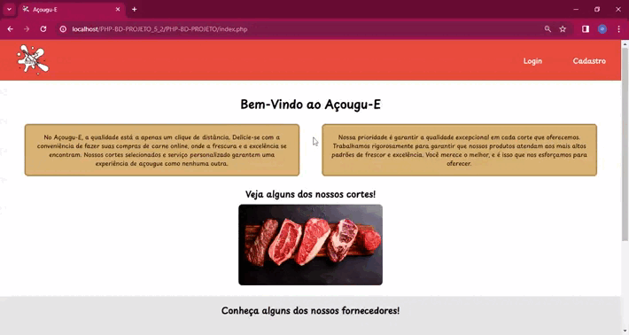
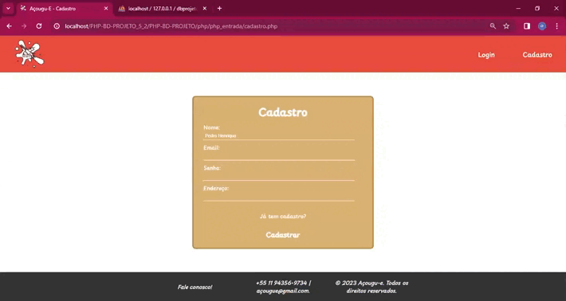
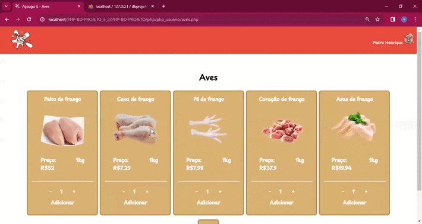
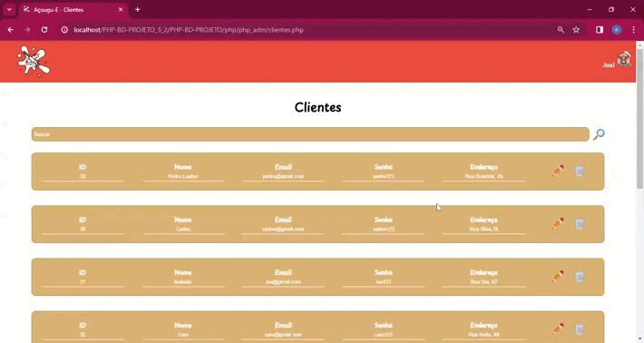
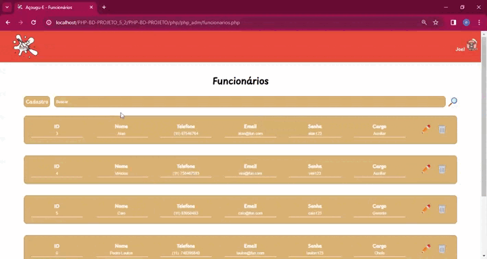
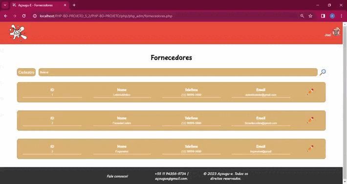
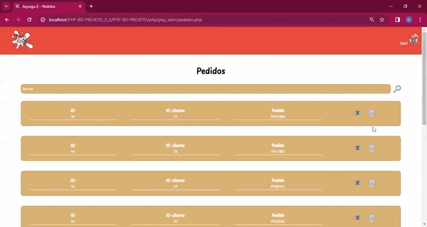

# Açougu-E 

Bem-vindo ao projeto da loja de açougue chamada ### Açougu-E! Este é um sistema web desenvolvido em PHP com banco de dados, destinado à gestão de uma loja. O projeto foi realizado em parceria com 4 pessoas.

## Contribuidores

- Caio Dib;
- Domenico Kenjy;
- Isabella Urdiali;
- Pedro Lauton.

## Funcionalidades

1. **Cadastro, Login e CRUD de Clientes:** Cadastre clientes, permita login e realize operações de criação, leitura, atualização e exclusão de registros de clientes.
   
2. **Carrinho de Compras:** Clientes podem adicionar produtos ao carrinho enquanto navegam pelo catálogo da loja.
   
3. **Pedidos de Clientes:** Os clientes podem realizar pedidos, especificando produtos e quantidade desejada.
   
4. **Cadastro e CRUD de Fornecedores:** Cadastre informações dos fornecedores e gerencie seus dados.
   
5. **Cadastro e CRUD de Funcionários:** Cadastre informações dos funcionários e gerencie seus registros.
   
6. **Visualização, Exclusão e Alteração de Pedidos:** Os administradores podem visualizar, excluir ou alterar pedidos conforme necessário.

## Linguagens

- PHP;
- MySQL;
- HTML;
- CSS;
- JavaScript.

## Screenshots e Gifs

- Tela inicial

- Cadastro e Login

- Pedidos dos clientes 

- Área do Adm

- Clientes

- Funcionários

- Fornecedores

- Pedidos

